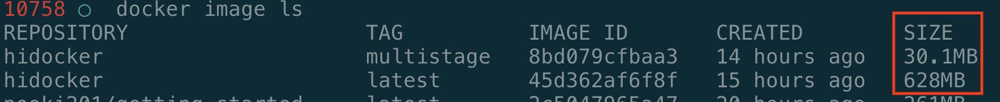
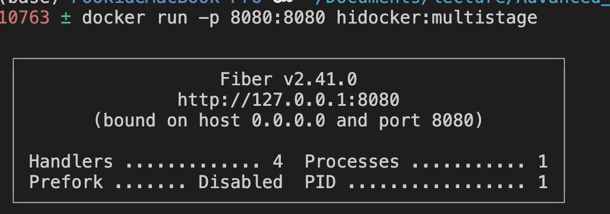
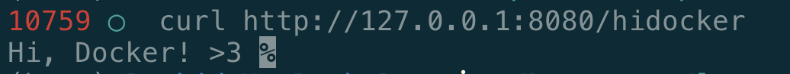

# Build go image

## Install Docker
[Get Docker](https://docs.docker.com/get-docker/)

## Create a Dockerfile
Create `Dockerfile` in project root directory. Write all commands needed to assemble go image in it.

```dockerfile
# syntax=docker/dockerfile:1

FROM golang:1.19.5-alpine

WORKDIR /app

COPY go.mod ./
COPY go.sum ./

RUN go mod download

COPY . ./

RUN go build -o /hidocker

CMD [ "/hidocker" ]
```

See: 

[Dockerfile reference](https://docs.docker.com/engine/reference/builder/)

[Build your Go image](https://docs.docker.com/language/golang/build-images/)

## Build image
In Dockerfile directory, run following cmd in your terminal

```
docker build --tag {image_name} .
```

## Multi-stage builds
After build, you can check the image via

```
docker image ls
```

Docker offers another type of multi-stage builds to reduce the size of generated images. The main idea behind multi-stage builds is to compile one image to generate some artefacts, and then copy those parts necessary to run the application into another image. This way we get a much smaller image.

Create another file named `Dockerfile.multistage`, write the commands in it.

```dockerfile
# syntax=docker/dockerfile:1

## Build
FROM golang:1.19.5-buster AS build

WORKDIR /app

COPY go.mod ./
COPY go.sum ./
RUN go mod download

COPY . ./

RUN go build -o /hidocker

## Deploy
FROM gcr.io/distroless/base-debian10

WORKDIR /

COPY --from=build /hidocker /hidocker
COPY --from=build /app/*.env .

EXPOSE 8080

USER nonroot:nonroot

ENTRYPOINT ["./hidocker"]
```

### Build
```
docker build --tag hidocker:multistage -f Dockerfile.multistage .
```



## Run Image
```
docker run -p 8080:8080 hidocker:multistage 
```



Then you can send request in your machine and get the response.




**Hint**

If your request get `curl: (52) Empty reply from server` error, please check go server code. The host in docker container is `0.0.0.0`, don't listen `127.0.0.1` in your server code. You can just config the port leave the host as default value.

