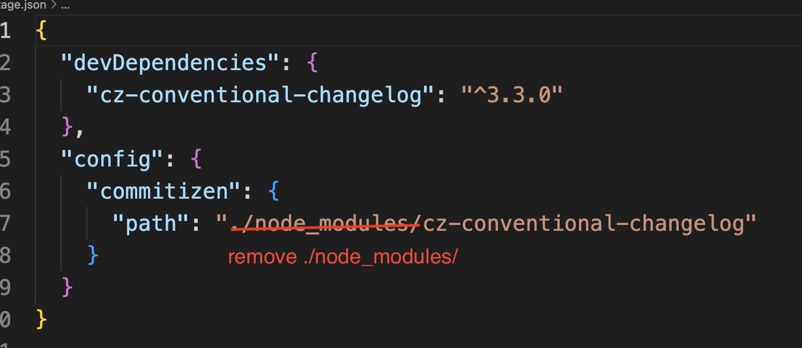
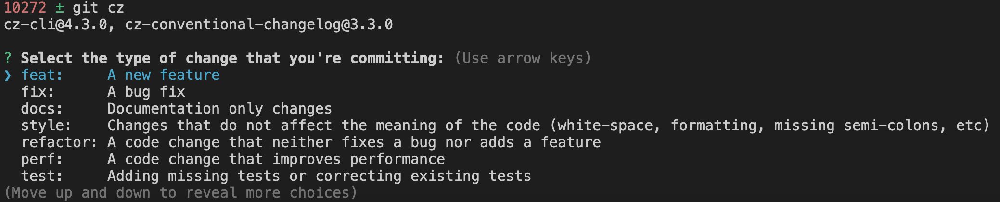

# Git Commit Message Conventions 
## Why do we need to format the git commit message?
1) Readability
2) Quick filter via keys
3) Easy to generate Change logs directly from commit messages

We use [**AngularJS Git Commit Message Conventions**](https://docs.google.com/document/d/1QrDFcIiPjSLDn3EL15IJygNPiHORgU1_OOAqWjiDU5Y/).

To make things simple, we can use [**commitizen**](https://github.com/commitizen/cz-cli) to do this.

## Install
```
npm install -g commitizen
```

Go to the project directory and run the following command to initialize:
```
commitizen init cz-conventional-changelog --save --save-exact
```

**Hint**

The automatically generated package.json may have a bug and you need to make the following change:



## Usage

Simply use `git cz` or just `cz` instead of `git commit` when committing. You can also use `git-cz`, which is an alias for `cz`.



# Code Style
## Frontend & Client
* [Google JavaScript Style Guide](https://google.github.io/styleguide/jsguide.html)

* Format code file
Use `Prettier` an extension in Visual Studio Code to format code file.

