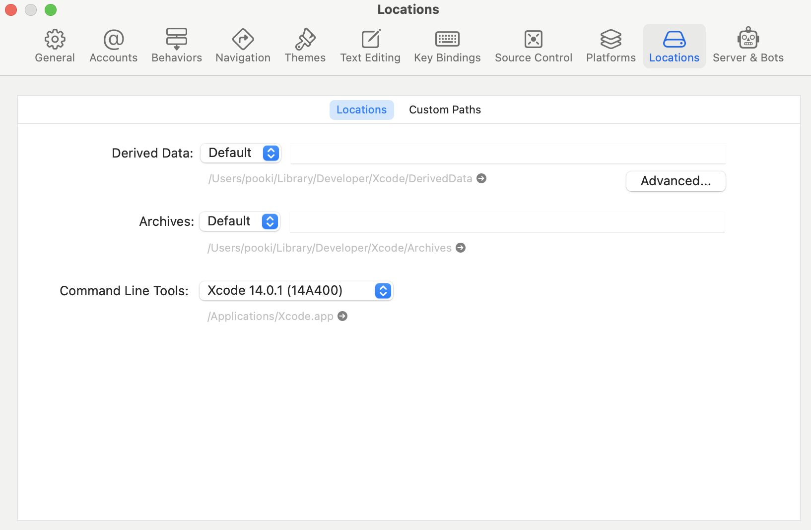

# Windows Environment
reference website: [[React Native Environment setup]](https://reactnative.dev/docs/environment-setup); 

Install packages: [[google drive]](https://drive.google.com/drive/folders/1MzehU88ySeDYO34NbUn-yCz0eEMMElct?usp=sharing); 

## Start the emulator from command line
Add environment variables in ~/.bash_profile
```
export ANDROID_HOME=/Users/pooki/Library/Android/sdk
export PATH=$ANDROID_HOME/emulator:$ANDROID_HOME/tools:$PATH
```
List all avds
```
emulator -list-avds
```
Start a emulator in terminal (replace Nexus_6_API_28 with your emulator name)
```
emulator @Nexus_6_API_28
```
or
```
emulator -avd Nexus_6_API_28
```


# iOS development environment on macOS

## install homebrew:
```sh
/bin/bash -c "$(curl -fsSL https://raw.githubusercontent.com/Homebrew/install/master/install.sh)"
```

## Installing dependencies
### node && watchman
```sh
brew install node
brew install watchman
```

### Ruby
#### check version
```sh
ruby -v
```

if the version isn't [2.7.6](https://github.com/facebook/react-native/blob/main/template/_ruby-version) then
```sh
rvm install ruby-2.7.6
rvm --default use 2.7.6
```

#### install bundler && cocoapods
```sh
gem install bundler
gem install cocoapods
```

### Xcode
Install Xcode via the Mac App Store, make sure it is version **10** or newer.

#### Command Line Tools
Open Xcode, then choose "Preferences..." from the Xcode menu. Go to the Locations panel and install the tools by selecting the most recent version in the Command Line Tools dropdown.


## Running React Native application
### Step 1: Start Metro
```sh
npx react-native start
```

### Step 2: Start your application
Let Metro Bundler run in its own terminal. Open a new terminal inside your React Native project folder. Run the following:
```sh
npx react-native run-ios
```
You should see your new app running in the iOS Simulator shortly.