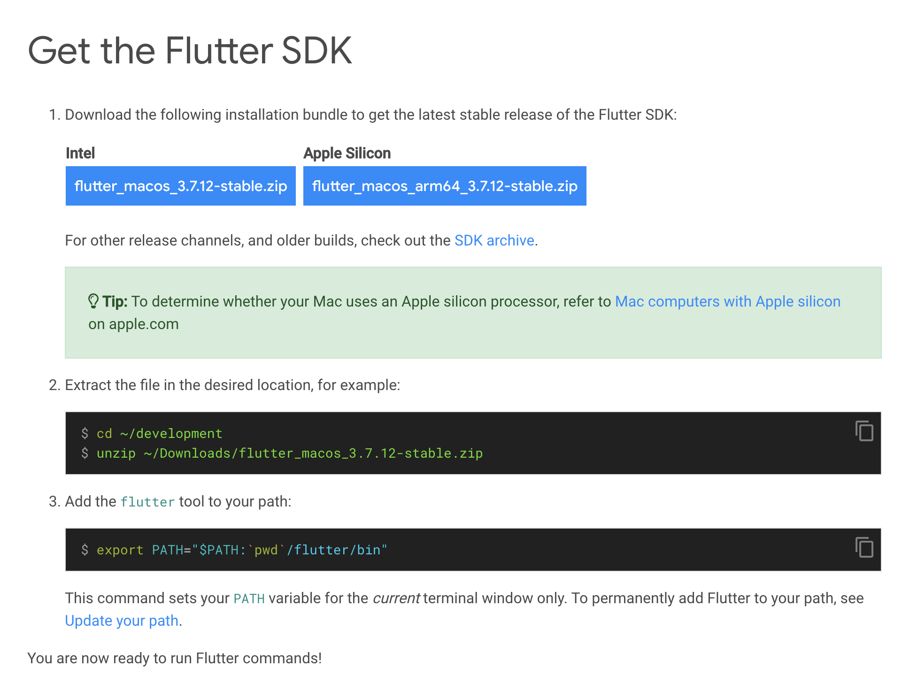
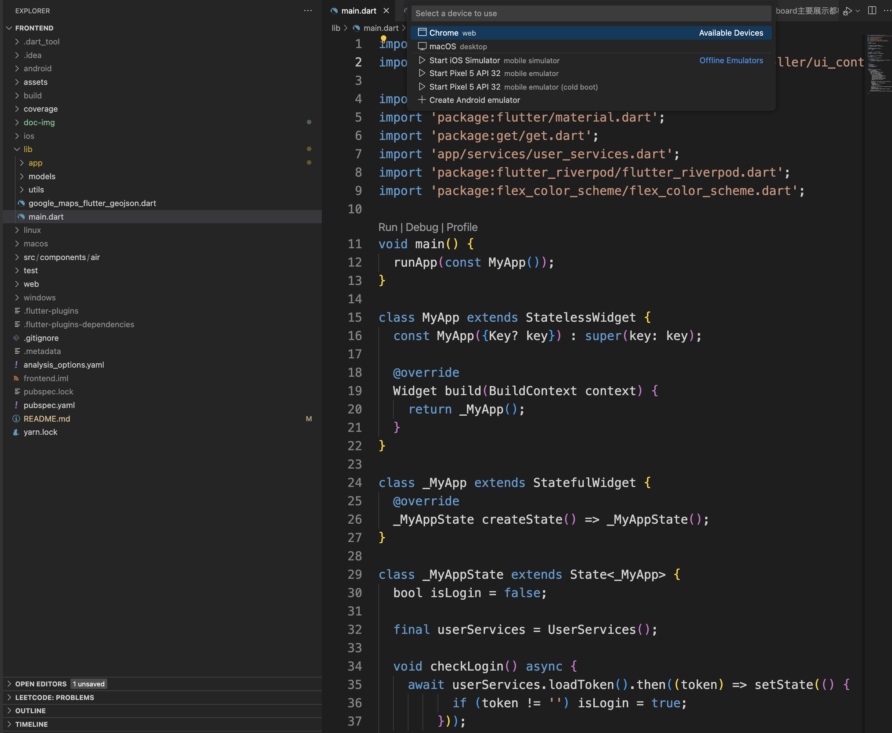

# Sustainable City Management Dashboard

## Dashboard Screen

This dashboard mainly displays the data of Dublin's air, noise, bicycles and other mobile/non-mobile entities.

## Setup Environment

### Install Flutter

You can follow this document to config flutter develop environment: [install-flutter](https://docs.flutter.dev/get-started/install/macos)




### Run Project
You can use `VSCode` to build and run or just run it in command-line:[flutter-cli](https://docs.flutter.dev/reference/flutter-cli).



Run following command in project root dir:

```
 flutter pub get
 flutter create .
 flutter run -d chrome
```